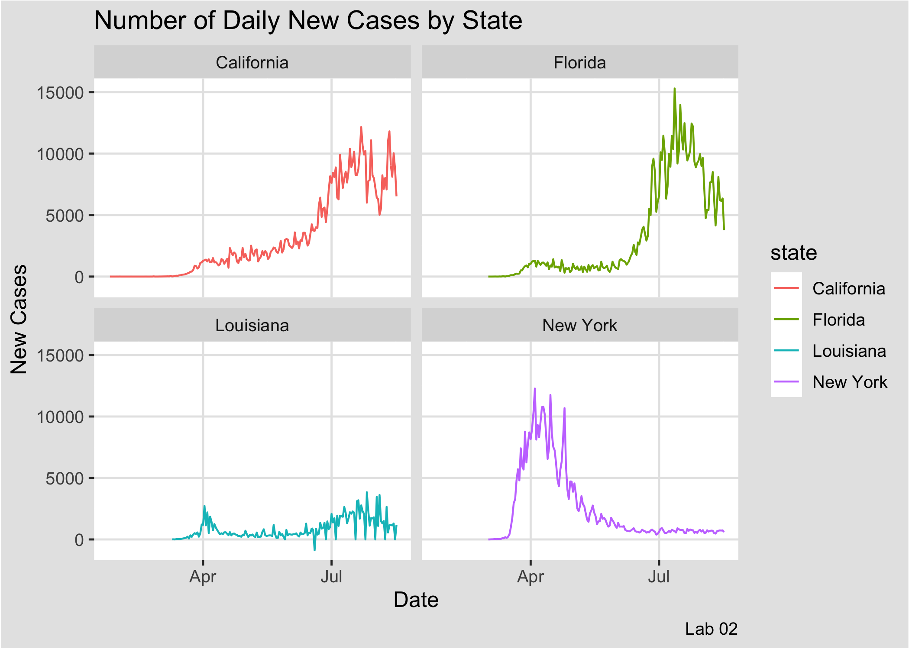
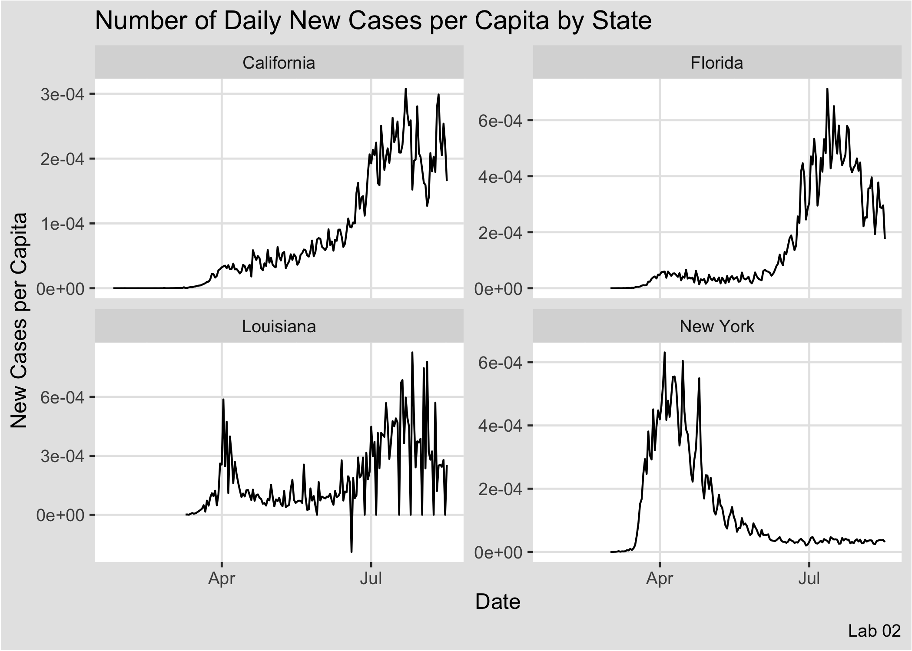

---
title: "Geography 176A"
author: "[Meagan Brown](https://meaganbrown.github.io)"
subtitle: 'Lab 02: COVID-19 Pandemic'
output:
  html_document:
    theme: darkly
---
> The following is a Report to Governor Newsom in regard to the most current COVID-19 conditions at the county level.

```{r echo=FALSE, message=FALSE, warning=FALSE, paged.print=FALSE}
library(tidyverse)
library(knitr)
library(readxl)
library(zoo)
library(kableExtra)
library(dplyr)
library(ggplot2)

url = 'https://raw.githubusercontent.com/nytimes/covid-19-data/master/us-counties.csv'
covid = read_csv(url)

dat = covid %>% 
  filter(state == "California") %>% 
  group_by(county) %>% 
  mutate(newCases = cases - lag(cases)) %>% 
  ungroup() %>% 
  filter(date == max(date)) 


most_new_cases = dat %>% 
  slice_max(newCases, n = 5) %>% 
  select(county, newCases)

most_cases = dat %>% 
  slice_max(cases, n=5) %>% 
  select(county,cases) 


knitr::kable(most_new_cases,              
        caption = "Most New Cases within California by County",
        col.names = c("County", "New Cases"),
        format.args = list(big.mark = ",")) %>% 
    kableExtra::kable_styling("striped", full_width = TRUE, font_size = 14)

knitr::kable(most_cases,              
      caption = "Most Cases within California by County",
      col.names = c("County", "New Cases"),
      format.args = list(big.mark = ",")) %>% 
    kableExtra::kable_styling("striped", full_width = TRUE, font_size = 14)
```

```{r echo=FALSE, message=FALSE, warning=FALSE, paged.print=FALSE}
library(readxl)
pop <- read_excel("~/Documents/github/geog-176A-labs/data/PopulationEstimates.xls", 
    skip = 2)

popu = 
  pop %>% 
  select(fips = "FIPStxt", state = "State", Area_Name, pop2019 = "POP_ESTIMATE_2019") %>% 
  right_join(covid, by = c("fips"))

cali = popu %>% 
  filter(state.x == "CA") %>% 
  group_by(county) %>% 
  mutate(newCases = cases - lag(cases)) %>% 
  mutate(cpc = cases/pop2019) %>% 
  mutate(cpcnew = newCases/pop2019) %>% 
  ungroup() %>% 
  filter(date == max(date)) 
 
mostNewCasesbypop = cali %>% 
  arrange((cpcnew)) %>% 
  slice_max(cpcnew, n = 5) %>% 
  select(county, New_Cases_Per_Capita = cpc)

mostCasesbypop = cali %>% 
  slice_max(cpc, n=5) %>% 
  arrange(-cpc) %>% 
  select(county,Cases_Per_Capita = cpc) 

knitr::kable(mostNewCasesbypop,              
        caption = "Most New Cases Per Capita within California by County",
        col.names = c("County", "New Cases Per Capita"),
        format.args = list(big.mark = ",")) %>% 
    kableExtra::kable_styling("striped", full_width = TRUE, font_size = 14)

knitr::kable(mostCasesbypop,              
      caption = "Most Cases per Capita within California by County",
      col.names = c("County", "Cases per Capita"),
      format.args = list(big.mark = ",")) %>% 
    kableExtra::kable_styling("striped", full_width = TRUE, font_size = 14)

fourteen = popu %>% 
  filter(date > max(date) - 14, state.x == "CA") %>% 
  group_by(fips) %>%
  mutate(newCases = cases - lag(cases)) %>% 
  summarize(cases14 = sum(cases, na.rm = TRUE),
            newCases14 = sum(newCases, na.rm = TRUE),
            pop2019 = max(pop2019)) %>% 
  mutate(pc_nc = newCases14 / (pop2019 / 100000)) %>% 
  filter(pc_nc <= 100) %>% 
  select(fips, pc_nc)


# (cases / unit) >= case / unit2
# 100,000 unit1 = unit2
```


>Based on my analysis of NY-Time Data, there are 105,617 new cases cases within California in the last 14 days and 621,981 total cases.There are 14 counties that can be considered safe, as they have had less than 100 new cases per 100,000 residents over the past 14 days.

***

# Plot 1

{width=50%}

# Plot 2

{width=50%}


>Scaling by population such as in plot #2 allows for data to be observed by taking into account the differences in population of different states. Although California has a greater number of COVID-19 cases, the number per capita is lower compared to Louisiana which, in relation to population, has a larger number of new cases. In plot #1 Louisiana looks like it is dealing with COVID well, however when we look at a per capita analysis such as in plot #2 we can observe that they have a very high number of new cases in relation to their population. 
