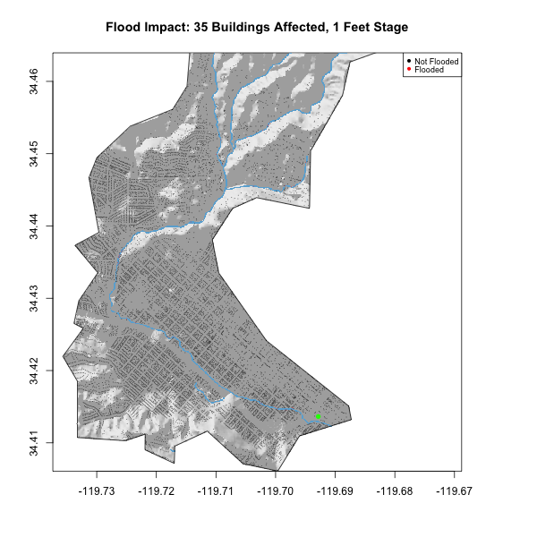

```{r message=FALSE, warning=FALSE, include=FALSE, paged.print=FALSE}
library(gifski)
library(tidyverse)
library(knitr)


library(sf)        # vector manipulation
library(raster)    # raster manipulation
library(fasterize) # "faster" raster


library(whitebox)  # terrain analysis

# Data libraries
library(osmdata)   # OSM API
library(elevatr)   # Elevation  Web Tiles
```

```{r message=FALSE, warning=FALSE, include=FALSE, paged.print=FALSE}

#basin boundary 
basin = read_sf("https://labs.waterdata.usgs.gov/api/nldi/linked-data/nwissite/USGS-11119750/basin")

#elevation data
elev_basin = get_elev_raster(basin, z=13) %>% 
  crop(basin) %>% 
  mask(basin)
elev_basin = elev_basin*3.281


writeRaster(elev_basin, "../data/Mission-Creek-Elev.tif", overwrite = T)
```

## Collecting Data

```{r message=FALSE, warning=FALSE, include=FALSE, paged.print=FALSE}

#buildings and river-network data


elev_raster = raster("../data/Mission-Creek-Elev.tif")

#building

bb = st_bbox(basin) %>% 
  st_as_sfc() %>% 
  st_transform(4326)

building = osmdata::opq(bb) %>% 
  add_osm_feature(key = "building") %>% 
  osmdata_sf()

rail = opq(bb) %>% 
  add_osm_feature(key = "railway", value = "station") %>% 
  osmdata_sf()

building_point = building$osm_polygons %>% 
  st_intersection(basin) %>% 
  st_transform(crs(basin)) %>% 
  st_centroid()

building_poly = building$osm_polygons %>% 
  st_intersection(basin) %>% 
  st_transform(crs(basin))

stream_osm = opq(bb) %>% 
  add_osm_feature(key = "waterway", value = "stream") %>% 
  osmdata_sf()

stream_line = stream_osm$osm_lines %>% 
  st_intersection(basin) %>% 
  st_transform(crs(basin))

railway_point = rail$osm_points %>% 
  st_intersection(basin) %>% 
  st_transform(crs(basin))
```


## Terrain Analysis

```{r message=FALSE, warning=FALSE, include=FALSE, paged.print=FALSE}
wbt_hillshade("../data/Mission-Creek-Elev.tif", "../data/Mission-Creek-Hillshade.tif")
```

```{r echo=FALSE, message=FALSE, warning=FALSE, paged.print=FALSE}
#hillshade

hillshade = raster("../data/Mission-Creek-Hillshade.tif")
plot(hillshade, col = gray.colors(256, alpha = .5), main = "Hillshade Basin and Stream", legend = F, box = F)
plot(stream_line, add = T, col = "blue")
plot(basin, add = T)

```


```{r message=FALSE, warning=FALSE, include=FALSE, paged.print=FALSE}
#creating river raster

stream_buff = stream_line %>% 
  st_transform(5070) %>% 
  st_buffer(10) %>% 
  st_transform(4326)
river_raster = fasterize::fasterize(stream_buff, elev_raster)

writeRaster(river_raster, "../data/stream-raster.tif", overwrite = T)
```

```{r message=FALSE, warning=FALSE, include=FALSE, paged.print=FALSE}
#creating hyrologically corrected surface

wbt_breach_depressions("../data/Mission-Creek-Elev.tif", "../data/breach-depressions.tif")

#HAND raster
wbt_elevation_above_stream("../data/breach-depressions.tif", "../data/stream-raster.tif", "../data/hand-raster.tif")
```

```{r message=FALSE, warning=FALSE, include=FALSE, paged.print=FALSE}
#final hand raster

hand_rast = raster("../data/hand-raster.tif")
flood_raster = raster("../data/stream-raster.tif")
offset_raster = hand_rast + 3.69
offset_raster[flood_raster == 1] = 0
writeRaster(offset_raster, "../data/offset_basin.tif", overwrite = T)
```

## 2017 Mission Creek Flood Impact Assessment 

```{r echo=FALSE, message=FALSE, warning=FALSE, paged.print=FALSE}

#map the flood

offset_raster = raster("../data/offset_basin.tif")
offsetraster1 = offset_raster
offset_raster[offset_raster > 10.02] = NA
plot(hillshade, col = gray.colors(256, alpha = .5), main = "Hillshade Basin and Flood", legend = F, box =F)
plot(offset_raster, add = T, col = rev(blues9), legend = F)
plot(basin, add = T)
plot(railway_point, col = "green", cex = 1, pch = 16, add = T)
```


>This map looks accurate. It is zoomed out, so we are able to see the entire scope of the river flows and how at 10.02ft, the railway became flooded. We can also see that more flooding occurred at the bottom of the streams rather than at the top because water flows downslope and collects there. 

```{r echo=FALSE, message=FALSE, warning=FALSE, paged.print=FALSE}
#estimate the impacts

building_points = ifelse(!is.na(raster::extract(offset_raster, building_point)), "red", "black")
plot(hillshade, 
     col = gray.colors(256, alpha = .5), 
     main = paste("2017 Mission Creek Basin Flood Affected", 
                  sum(building_points == "red"), "Buildings"), legend = F, box =F)
plot(offset_raster, add = T, col = rev(blues9), legend = F, box = F)
plot(basin, add = T)
plot(railway_point, col = "green", cex = 1, pch = 16, add = T, box = F)
plot(building_point, add = T, col = building_points, cex = .08, pch = 16)
```


## Extra Credit: Flood Inundation Map Library


```{r message=FALSE, warning=FALSE, include=FALSE, paged.print=FALSE}
remotes::install_github("mikejohnson51/AOI")

sb = AOI::aoi_get("Santa Barbara")

```

```{r message=FALSE, warning=FALSE, include=FALSE, paged.print=FALSE}
hillshade_gif <- raster("../data/Mission-Creek-Hillshade.tif") %>% 
  crop(sb)

gif_rast <- offset_raster %>% 
  crop(sb)
building_gif <- st_intersection(basin, building_point)
```

```{r message=FALSE, warning=FALSE, include=FALSE, paged.print=FALSE}
save_gif({
  for(i in 1:20){
    flood_gif <- gif_rast
    values(flood_gif)[which(values(flood_gif) > i)] <- NA
    
    building_flood <- raster::extract(flood_gif, building_gif)
    building_gif$flooded <- as.factor(ifelse(!is.na(building_flood), 1, 0))
    
    
    plot(hillshade_gif, col = gray.colors(256, alpha = .5), box = FALSE, 
         main = paste('Flood Impact:', sum(building_gif$flooded==1) ,'Buildings Affected,', i, 'Feet Stage'), legend = FALSE)
    plot(flood_gif, col = rev(blues9), box = FALSE,  add = TRUE, legend = FALSE)
    plot(building_point, col = c('black','red')[building_gif$flooded], box = FALSE, add = TRUE, cex = .15, pch = 16)
    plot(railway_point, col = 'green', box = FALSE, add = TRUE, cex = 1, pch = 16)
    plot(basin, box = FALSE, add = TRUE)
    legend(x = 'topright', legend = c('Not Flooded', 'Flooded'), 
       col = c('black','red'), cex = .75, pch = 16)
  }
  
}, gif_file = "../data/mission-creek-fim.gif",
   width = 600, height = 600, 
   delay = .7, loop = TRUE)
```




>At stage 0, we have a river buffer of 10 meters. This buffer causes houses that have not yet been effected yet to be considered inundated. This could be used as a precaution. 


